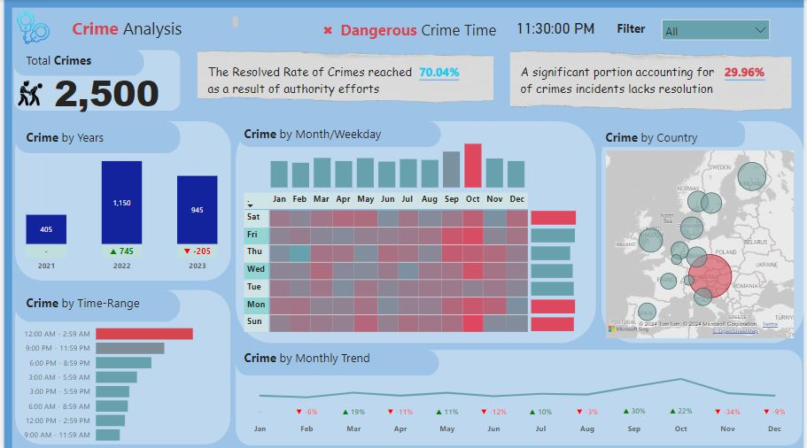

CRIME ANALYSIS REPORT
DASHBOARD TASKS
1. Total Crimes:
- Sum of all reported crimes in the dataset.
2. Crime Distribution by Year and Yearly Changes:
- Analysis of crimes categorized by year, including insights into the year-over-year changes.
3. Crimes by Time Range (e-g-, 3:00 AM to 5:59 AM):
- Exploration of crime occurrences within specific time intervals, providing a detailed breakdown.
4. Hitmap Showing Crime Distribution by Weekdays and Months:
- Visualization using a hitmap to illustrate how crimes are distributed across weekdays and months.
5. Crimes by Country:
- Examination of crimes categorized by the country where they occurred.
6. Total Resolved and Unresolved Crimes:
- Distinction between resolved and unresolved crimes, offering an overview of the overall resolution rate.
7. Monthly Crime Trend with Percentage Variance:
- Analysis of the monthly crime trend, accompanied by the percentage variance to highlight fluctuations.
8. Identification of the Most Dangerous Time of the Day:
- Exploration to pinpoint the specific time periods during the day associated with a higher frequency of crimes

Crime Analysis Report
Dashboard Overview
Key Metrics and Visualizations
Total Crimes:

Measure: Total Crimes
Insight: The dataset reveals a total of 2,500 reported crimes.
Crime Distribution by Year and Yearly Changes:

Measures: Crime Previous Year, Label (Year), Conditional Formatting (Year)
Insight: The year 2022 experienced the highest crime rate with 1,150 incidents, marking a significant increase of 745 crimes from the previous year.
Crimes by Time Range (e.g., 3:00 AM to 5:59 AM):

Column: Crime Time Group
Insight: The highest concentration of crimes occurred between 12:00 AM and 2:59 AM.
Heatmap Showing Crime Distribution by Weekdays and Months:

Visualization: Heatmap
Insight: The analysis shows that Saturday, Sunday, and Monday have the highest crime rates, with October being the month with the most reported crimes.
Crimes by Country:

Insight: Austria reported the highest number of crimes with a total of 879 incidents.
Total Resolved and Unresolved Crimes:

Measures: Crimes Resolved, Crimes Unresolved
Insight: The resolution rate of crimes stands at 70.04%, leaving 29.96% unresolved.
Monthly Crime Trend with Percentage Variance:

Measures: Crime Previous Month, Label (Month), Conditional Formatting (Month)
Insight: Significant crime rate fluctuations were observed, with notable increases in October and decreases in November.
Identification of the Most Dangerous Time of the Day:

Insight: The period between 12:00 AM and 2:59 AM is identified as the most dangerous time of day with the highest frequency of crimes.
Yearly Breakdown of Crime Data

2021:

Total Crimes: 405

Resolved Rate: 68.64%

Unresolved Rate: 31.36%

Peak Crime Time: 12:00 AM - 2:59 AM (112 crimes)

Highest Crime Month: October (125 crimes)

Most Crime-Heavy Days: Saturday, Sunday, Monday

Highest Crime Country: Austria (177 crimes)

Crime Rate Fluctuations: Crime rate increased by 52% in October (125 crimes) and decreased by 18% in November (103 crimes).

2022:

Total Crimes: 1,150

Resolved Rate: 72.43%

Unresolved Rate: 27.57%

Peak Crime Time: 12:00 AM - 2:59 AM (278 crimes)

Highest Crime Month: October (101 crimes)

Most Crime-Heavy Days: Saturday, Sunday, Monday

Highest Crime Country: Austria (397 crimes)

Crime Rate Fluctuations: Crime rate increased by 25% in October (101 crimes) and decreased by 4% in November (97 crimes).

2023:

Total Crimes: 945

Resolved Rate: 67.72%

Unresolved Rate: 32.28%

Peak Crime Time: 12:00 AM - 2:59 AM (248 crimes)

Highest Crime Month: October (83 crimes)

Most Crime-Heavy Days: Saturday, Sunday, Monday

Highest Crime Country: Austria (305 crimes)

Crime Rate Fluctuations: Crime rate increased by 28% in March (110 crimes) and decreased by 94% in November (5 crimes).

Breakdown by Crime Types

Violence and Sexual Offences: 147 incidents

Anti-Social Behavior: 77 incidents

Public Order: 33 incidents

Criminal Damage and Arson: 23 incidents

Vehicle Crime: 23 incidents

Shoplifting: 20 incidents

Drugs and Illegal Substances: 16 incidents

Theft from a Person: 13 incidents

Burglary: 8 incidents

Bicycle Theft: 6 incidents

Robbery and Mugging: 5 incidents

Possession of Weapons: 4 incidents

Data Preparation and Analysis Steps
Load the Tables:

Tables Loaded: Crime Table (including "Other" and "Crime" tables).
Remove Longitude Column:

Action: The Longitude column was removed from the dataset to streamline the analysis.
Split Crime DateTime:

Action: The datetime column was split to isolate the time component, as the date was already available in a separate column.
Extract Time of Day (AM/PM):

Column Created: "Moments" to capture the time of day (AM or PM).
Create Date Table:

Action: A new Date table was created to facilitate time-based analysis.
Data Modeling:

Action: Connected the crime date to the Date table for accurate time series analysis.
Create Calculations Table:

Action: A new table named "Calculations" was created to store all calculated measures.
Create Measures:

Measures Created:
Total Crimes
Crime Previous Year
Label (Year)
Blank Measure (Year)
Conditional Formatting (Year)
Blank Measure (Month)
Crime Previous Month
Label (Month)
Conditional Formatting (Month)
Create Columns:

Columns Created:
Crime Time Group
Week Day
Resolved and Unresolved Crimes Measures:

Measures Created: Calculations to differentiate resolved and unresolved crimes.
Detail Page Creation:

Action: Created a new page named "Detail" and enabled DrillThrough functionality.
Create DrillThrough Measure:

Measure Created: "DrillThrough" to display the weekday and time group of crimes.
Create High-Level Crime Chart:

Visualization: A chart to highlight which crimes are most prevalent.

Insights from the Analysis

Total Crimes: 2,500 reported incidents.

Resolved Crimes: 70.04%, indicating effective law enforcement efforts.

Unresolved Crimes: 29.96%, highlighting areas for improvement.

Yearly Crime Trends: Significant increase in 2022 with 1,150 crimes, 745 more than in 2021.

Peak Crime Times: 12:00 AM to 2:59 AM is the most crime-prone time.

Monthly Trends: October consistently has the highest crime rates.

Weekly Trends: Saturday, Sunday, and Monday have the highest crime occurrences.

Country-Specific Data: Austria has the highest crime rate with 879 incidents.

Recommendations

Enhance Nighttime Patrols: Increase law enforcement presence between 12:00 AM and 2:59 AM, as this is the most dangerous time of day.

Focus on October: Implement targeted crime prevention strategies in October, which has the highest crime rates.

Weekend Strategies: Allocate more resources to Saturday, Sunday, and Monday to address the higher crime rates.

Resolve Unresolved Crimes: Strengthen investigative processes to reduce the 29.96% unresolved crime rate.

Country-Specific Measures: Focus on Austria with specific crime reduction programs given its high crime rate.
